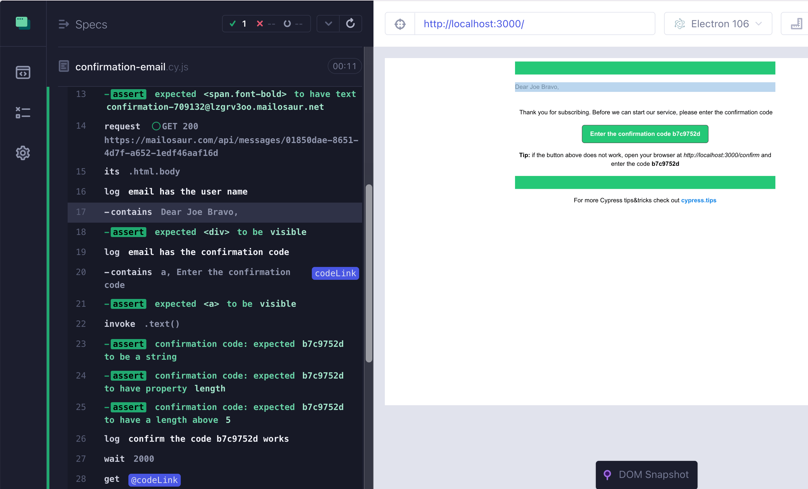

# cypress-sendgrid-mailosaur-example  [](https://github.com/bahmutov/cypress-sendgrid-mailosaur-example/actions/workflows/ci.yml)

> Sending and testing email flows example

- Sending emails via Sendgrid
- Fetching sent emails using [cypress-mailosaur](https://github.com/mailosaur/cypress-mailosaur)
- End-to-end testing using Cypress



## Prerequisites

SendGrid account with API key and a verified email sender, see [this doc](https://sendgrid.com/docs/for-developers/sending-email/quickstart-nodejs/). Similarly you need Mailosaur server ID and API key.

## Install

```shell
$ npm install
```

## Run

Start the server locally with injected `SENDGRID_API_KEY` and `SENDGRID_FROM` environment variables.

```
SENDGRID_API_KEY=... SENDGRID_FROM=... npm start
```

**Tip:** use [as-a](https://github.com/bahmutov/as-a) utility. Put the environment variables into `.as-a.ini` file and give it the same section name as the folder name.

```ini
; http://github.com/bahmutov/as-a
[cypress-sendgrid-mailosaur-example]
; sending emails
SENDGRID_API_KEY=...
SENDGRID_FROM=...
; checking emails
CYPRESS_MAILOSAUR_SERVER_ID=...
CYPRESS_MAILOSAUR_API_KEY=...
```

Start the local application and open Cypress using [start-server-and-test](https://github.com/bahmutov/start-server-and-test) utility

```text
$ as-a . npm run local
```

## See also

- 💻 [Full End-to-End Testing for Your HTML Email Workflows](https://slides.com/bahmutov/email-testing) presentation
- 📝 [Testing email flows with Mailosaur](https://filiphric.com/testing-email-flows-with-mailosaur)

## Small print

Author: Gleb Bahmutov &lt;gleb.bahmutov@gmail.com&gt; &copy; 2022

- [@bahmutov](https://twitter.com/bahmutov)
- [glebbahmutov.com](https://glebbahmutov.com)
- [blog](https://glebbahmutov.com/blog)
- [videos](https://www.youtube.com/glebbahmutov)
- [presentations](https://slides.com/bahmutov)
- [cypress.tips](https://cypress.tips)
- [Cypress Tips & Tricks Newsletter](https://cypresstips.substack.com/)
- [my Cypress courses](https://cypress.tips/courses)

License: MIT - do anything with the code, but don't blame me if it does not work.

Support: if you find any problems with this module, email / tweet /
[open issue](https://github.com/bahmutov/cypress-sendgrid-mailosaur-example/issues) on Github

## MIT License

Copyright (c) 2022 Gleb Bahmutov &lt;gleb.bahmutov@gmail.com&gt;

Permission is hereby granted, free of charge, to any person
obtaining a copy of this software and associated documentation
files (the "Software"), to deal in the Software without
restriction, including without limitation the rights to use,
copy, modify, merge, publish, distribute, sublicense, and/or sell
copies of the Software, and to permit persons to whom the
Software is furnished to do so, subject to the following
conditions:

The above copyright notice and this permission notice shall be
included in all copies or substantial portions of the Software.

THE SOFTWARE IS PROVIDED "AS IS", WITHOUT WARRANTY OF ANY KIND,
EXPRESS OR IMPLIED, INCLUDING BUT NOT LIMITED TO THE WARRANTIES
OF MERCHANTABILITY, FITNESS FOR A PARTICULAR PURPOSE AND
NONINFRINGEMENT. IN NO EVENT SHALL THE AUTHORS OR COPYRIGHT
HOLDERS BE LIABLE FOR ANY CLAIM, DAMAGES OR OTHER LIABILITY,
WHETHER IN AN ACTION OF CONTRACT, TORT OR OTHERWISE, ARISING
FROM, OUT OF OR IN CONNECTION WITH THE SOFTWARE OR THE USE OR
OTHER DEALINGS IN THE SOFTWARE.
